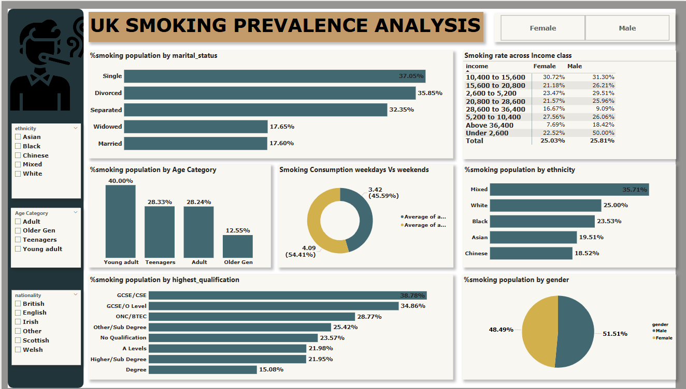

# Uk-Smoking-Prevalence-Analysis
## 🎯 1. Project Objective
To analyze smoking habits across demographic and socio-economic groups in the UK. This prohect helps identify key patterns and potential public health intervention areas based on age, gender, income, education, ethnicity, and marital status.

## 📂 2. Dataset Overview
The dataset captures the percentage of smoking population distributed across:
•	Demographics: Gender, Age Category, Ethnicity, Nationality
•	Socio-Economic Factors: Income Class, Education Level
•	Lifestyle Attributes: Marital Status, Weekly vs Weekend Smoking Patterns

## 🛠 3. Tools Used
•	Power BI: Dashboard creation and data visualization
•	Excel: Data cleaning and transformation
•	Power Query: For data shaping

## 🧹 4. Data Preparation
•	Standardized categorical labels (e.g., gender, marital status)
•	Grouped income and education levels
•	Calculated average consumption on weekdays vs weekends
•	Filter panels built for interactivity by ethnicity, age group, and nationality

## 🗃️ 5. Data Model Summary
A flat structure was likely used due to the demographic-focused nature of the data. Each record represents a group percentage segmented by multiple attributes like gender, income, education, etc.

## 📊 6. Visualization

Key categories analyzed include:
### Smoking by Marital Status
- Highest among Singles (37.05%) and Divorced (35.85%)
- Lowest among Married (17.60%) and Widowed (17.65%)

### Smoking by Age Category
-	Young Adults are most likely to smoke (40%), followed by Teenagers (28.33%)
-	Lowest prevalence among Older Generation (12.55%)

### Weekday vs Weekend Smoking
- Average consumption:
- Weekends: 54.41%
- Weekdays: 45.59%

- Suggests higher consumption on weekends (54.41%)

### Smoking by Income Class
- Higher prevalence among lower-income groups:
- 10,400 to 15,600: ~31% (both genders)
- Under 2,600: Females (22.52%), Males (50.00%)

- Sharp decline in higher income classes (e.g., Above 36,400: Female: 7.69%, Male: 18.42%)
### Smoking by Ethnicity
- Highest among Mixed ethnicity (35.71%)
- Followed by White (25%) and Black (23.53%)
- Lowest among Chinese (18.52%) and Asian (19.51%)

### Smoking by Gender
- Male smokers (51.51%) slightly exceed females (48.49%)

### Smoking by Highest Qualification
- Highest among those with GCSE/CSE (38.78%) and GCSE/O Level (34.86%)
- Decreases with higher education:

### Degree holders: only 15.08%

## 👁️ 7. Observations
- Education and Smoking Inversely Correlated: Lower qualifications significantly associate with higher smoking rates.
- Young Adults Most Affected: Age group 18–30 appears most vulnerable.
- High Weekend Consumption: Weekends see elevated smoking levels, suggesting lifestyle or social factors.
-	Income Impact: Smoking rates decline as income increases. Particularly high rates in the lowest two brackets.
- Ethnic Variation: Mixed ethnic groups and White individuals show higher prevalence.
- Marital Status Insight: Being single or divorced correlates with higher smoking behavior.
- Gender Gap Narrowing: Though slightly higher among males, smoking rates are relatively balanced across genders.

## ✅ 8. Recommendations
1.	Targeted Campaigns for Young Adults
o	Anti-smoking campaigns should focus on young adults and teenagers through social media, colleges, and youth programs.
2.	Education-Based Interventions
o	Incorporate smoking awareness into school curricula, especially in areas with low education attainment.
3.	Income-Level Awareness Programs
o	Provide free cessation support in low-income communities, including financial incentives or subsidies.
4.	Weekend-specific Messaging
o	Run campaigns over weekends, emphasizing health risks linked with binge smoking patterns.
5.	Support for High-Risk Marital Groups
o	Partner with mental health services to address stress-related smoking in divorced or single populations.
6.	Community & Ethnicity-Centric Engagement
o	Culturally tailored interventions for Mixed and White communities with higher prevalence rates.
7.	Gender-Neutral Public Health Messaging
o	Address both male and female audiences, reflecting the minimal gap in smoking behavior.

